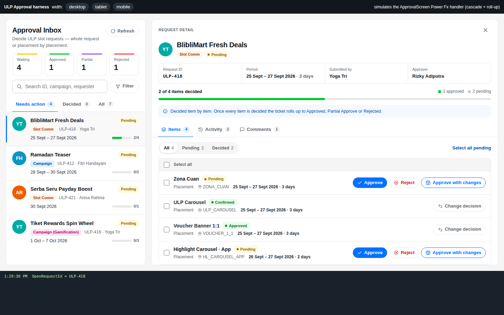
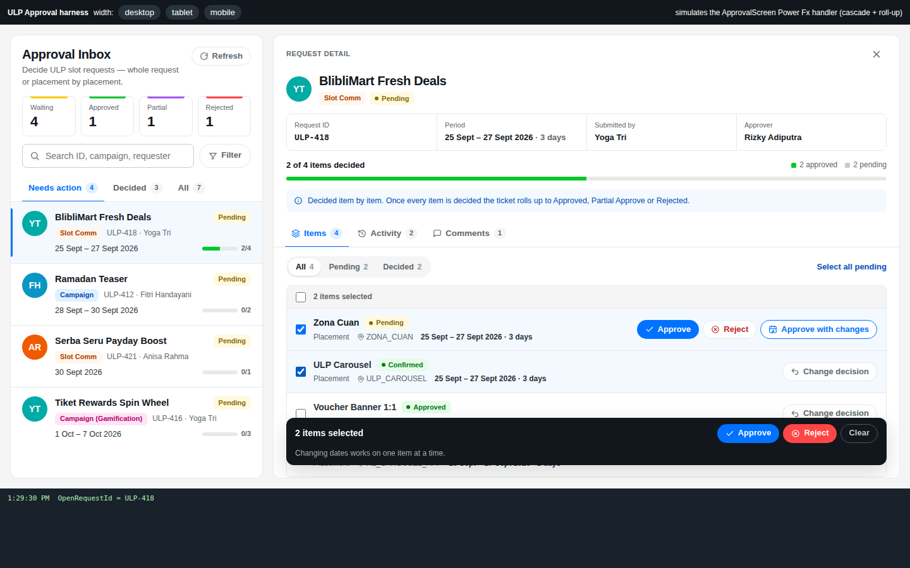
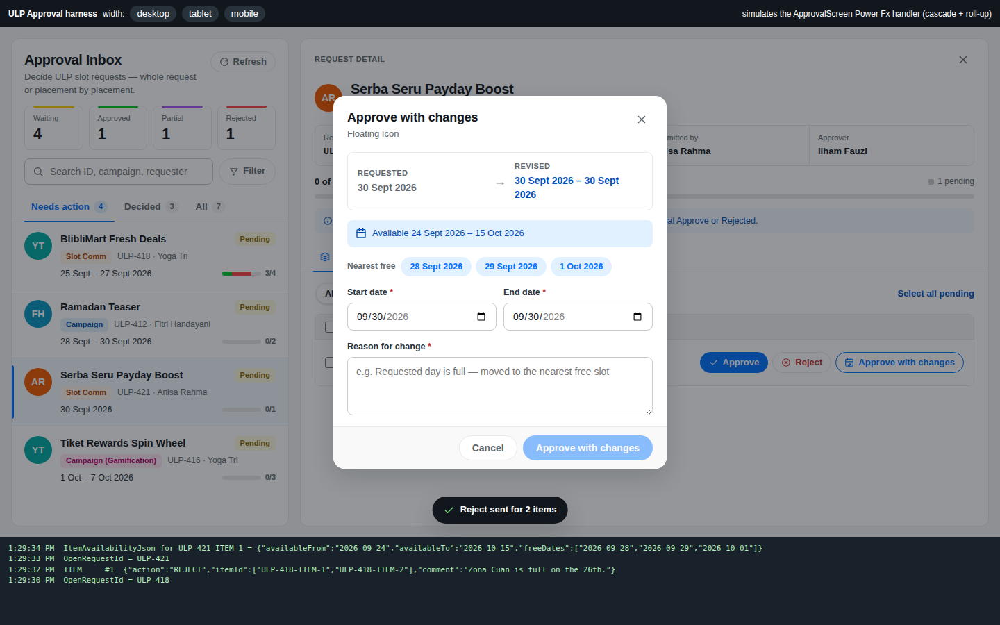
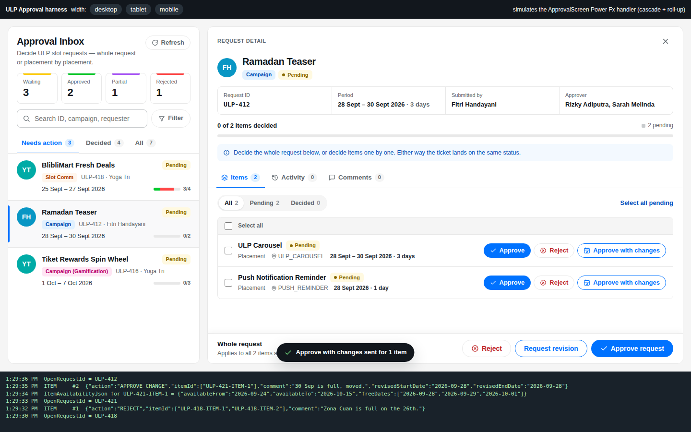
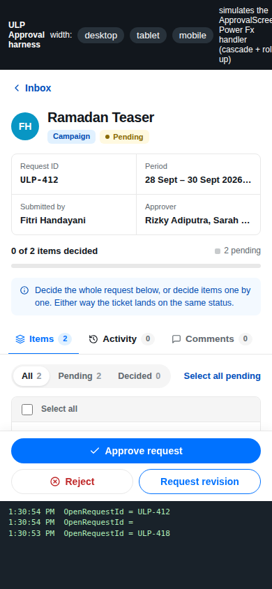

# ULP Hub PCF controls

| Control | Solution | Docs |
|---|---|---|
| `PowerAppsVibe.ApprovalUIManagement` — approval inbox (request- and item-level) | `ApprovalUIManagement` 1.6 → 2.0 | this page |
| `DK.Components.MarketingSlotCalendar` — placement × day slot calendar | `MarketingSlotCalendarSolution` 1.1 → 2.0 | [docs/MarketingSlotCalendar.md](docs/MarketingSlotCalendar.md), [Power Fx](docs/MarketingSlotCalendar-PowerFx.md) |

Both are upgrades in place: same component names and contracts, so the existing screens keep working.

---

# ApprovalUIManagement — PCF control v2

Source for the `PowerAppsVibe.ApprovalUIManagement` code component (solution `ApprovalUIManagement`,
previously 1.6.0) used on **ApprovalScreen** in the ULP Hub canvas app as `ApprovalUIManagement1`. v2 redesigns the UI in the Blibli (Blu Basic) look of the ULP Hub dashboard mockups
and makes **item-level (per-placement) approval** the centre of the detail pane. Campaign types keep a
whole-request decision bar on top of it.

**The output contract is unchanged.** The ApprovalScreen `OnChange` handler (blocks A, B and C) works
as it is: same namespace, constructor, properties, datasets (no property-sets, columns come from the
Fields pane), payload shapes and sequence counters. v2 only adds two optional input properties.



## What changed for the approver

| Area | 1.6 | 2.0 |
|---|---|---|
| Inbox | table / cards with summary counts | request cards (avatar, type chip, period, item progress), tabs **Needs action / Decided / All**, KPI strip, search, filter panel |
| Request decision | dropdown action bar in the detail pane | **Whole request** bar with explicit buttons (Reject · Request revision · Approve request), still controlled by `allowRequestActions`. For Campaign types the confirm dialog spells out the cascade to items and bookings |
| Item decision | Items tab: a table plus a dropdown bulk bar | every item row has its own **Approve / Reject / Approve with changes** buttons, plus multi-select with a floating bulk bar and filters **All / Pending / Decided**. A decided item collapses to *Change decision* |
| Approve with changes | date pickers + availability line | requested → revised comparison, availability window, fully booked days, daily-capacity message, optional *Nearest free* chips, dates pre-filled from the item |
| Progress | none | "x of n items decided" with a segmented bar (approved / with changes / rejected / pending) |
| History / Comments | plain lists | Activity timeline coloured by action, and Comments as a chat thread |
| Feedback | dialogs close on confirm | the same, plus: affected rows show *Updating* until the lists report the new status (or 20 s pass), and a toast confirms the send |
| Layout | — | desktop split view; tablet and mobile show the detail full-width with sticky tabs and decision bar |

| Bulk select | Approve with changes | Whole request (Campaign) | Mobile |
|---|---|---|---|
|  |  |  |  |

## Output contract (unchanged)

| Output | When it changes | Value |
|---|---|---|
| `ActionSequence` / `ApprovalActionPayloadJson` | whole-request decision confirmed | `{"action":"APPROVE","requestId":["ULP-412"],"comment":"…"}`. `requestId` always holds exactly the open request. `comment` is present only when typed |
| `ItemActionSequence` / `ItemActionPayloadJson` | item decision confirmed (one row or a bulk selection) | `{"action":"REJECT","itemId":["ULP-418-ITEM-1","ULP-418-ITEM-2"],"comment":"…"}` |
| | Approve with changes (one item) | `{"action":"APPROVE_CHANGE","itemId":["…"],"comment":"…","revisedStartDate":"2026-09-28","revisedEndDate":"2026-09-28"}` |
| `OpenRequestId` | a request is opened or closed | request id, or `""` |
| `PendingDateChangeItemId` | the date dialog opens or closes | item id, or `""`. Keep `ItemAvailabilityJson` bound to it |
| `SelectedItemIdsJson` | item checkboxes change | JSON array |
| `SelectedRequestIdsJson` | a request is opened | `["<open id>"]` (the inbox does not multi-select requests) |

Action keys are exactly the ones the handler switches on: `APPROVE`, `CONFIRM`, `REJECT`, `REVISION`
(request) and `APPROVE`, `CONFIRM`, `REJECT`, `APPROVE_CHANGE` (item).

## Properties kept from 1.6

| Property | Behaviour in v2 |
|---|---|
| `allowRequestActions` | false hides the Whole request bar (bind it per request type, as in 1.6) |
| `approverField` | now defaults to `ApprovedBy`. The Approver column is read only when ApprovedBy is empty. The old default value `approver` is treated the same as `ApprovedBy`. Add ApprovedBy to the dataset fields |
| `allowItemActions` | false makes the Items tab read-only: no row buttons, checkboxes or bulk bar |
| `itemStartDateField`, `itemEndDateField` (default `StartDate`, `EndDate`) | shown on each item row and used to pre-fill the date dialog |
| `ItemAvailabilityJson` | same input as 1.6: optional `availableFrom` / `availableTo` window (no window = any period), `blockedDates` or `fullDates`, `placementName`, `dailyCapacity`. Unreadable JSON blocks the dialog. v2 also reads an optional `freeDates` list, shown as *Nearest free* chips |

Column reading follows 1.6: a field that is not in the dataset metadata is still read by name (several
spellings, then the formatted value), and the resolved mapping is written once to `console.debug`.

## New optional properties

| Property | Default | Purpose |
|---|---|---|
| `itemPlacementIdField` | `PlacementId` | placement shown on each item row |
| `requestLevelTypes` | *(blank)* | optional extra filter for the Whole request bar, e.g. `Campaign;Campaign (Gamification)`. Blank = every type, so `allowRequestActions` alone decides, exactly as in 1.6 |

A whole-request APPROVE / REJECT on Campaign and Campaign (Gamification) marks the items as *Updating*
as well, because block A cascades those (`varCascade`). For other types only the header is expected to move.

## Action configuration (`ApprovalConfigJson`)

The JSON shape is the same as 1.6. Each row may now carry an optional `"scope": "request" | "item" | "both"`.
When it is left out, the scope is inferred so that no button sends a key the handler ignores at that level:

- `REVISION` is request-only (block B has no branch for it).
- `CONFIRM` and `APPROVE_CHANGE` are item-only. A request-level `CONFIRM` sets the header but cascades nothing.
- Any action with `requiresDateChange` is item-only.

`CONFIRM` is **off by default** now, because Approve covers the same outcome. Add
`{"key":"CONFIRM","label":"Confirm","resultStatus":"Confirmed","requiresComment":false,"requiresDateChange":false,"requiresConfirmation":true,"active":true,"order":2}`
to the config to bring it back.

## Build, test, package

```bash
npm install
npm run build          # pcf-scripts: lint + typecheck + bundle -> out/controls/{ApprovalUIManagement,MarketingSlotCalendar}
npm run harness        # http://localhost:8181 - mock datasets + a JS copy of the Power Fx cascade/roll-up
                       # http://localhost:8181/harness/calendar.html - slot calendar harness
npm run package -- --base path/to/ApprovalUIManagement_1_6_0_0_managed.zip --version 2.0.0.2
npm run package -- --base path/to/MarketingSlotCalendarSolution_managed.zip --version 2.0.0.1
```

`npm run package` takes an existing solution export and replaces only the code component(s) it
contains with the fresh build (names read from the built manifests and the solution's publisher prefix). It keeps everything else
in the zip and the managed flag, bumps the version, and writes `dist/ApprovalUIManagement_2_0_0_0_managed.zip`. Import that zip over the current
solution (**Solutions → Import → Upgrade**). Then, in the canvas app: **Get more components → Code →
refresh the component**, and republish.

The harness page logs every output exactly as the canvas app would see it, so a payload change can be
checked without going through Studio. Query flags: `?allowRequest=0`, `?allowItem=0`,
`?types=Campaign;Campaign%20(Gamification)`.

## Project layout

```
ApprovalUIManagement/
  ControlManifest.Input.xml   properties and datasets (1.6 set + two optional v2 ones)
  index.ts                    PCF lifecycle, outputs, sequence counters
  lib/                        types, action config, dataset mapping, formatting
  components/                 App, Inbox, Detail, ItemsPanel, Dialogs, Primitives, Icons
  styles/                     Blibli tokens, all scoped under .uam-root
MarketingSlotCalendar/
  ControlManifest.Input.xml   1.1 contract + three optional v2 properties (virtual control, platform React)
  index.ts                    PCF lifecycle, outputs, payload
  lib/                        types, dates, capacity rules, dataset / JSON reading, sample data
  components/                 App, CapacityGrid, WeekBoard, Timeline, ListView, DayPanel, BookingDialog, Agenda, ui
  css/                        Blibli tokens, all scoped under .msc-root
harness/                      local test pages (not shipped)
solution/package-solution.js  builds the importable solution zip
```
