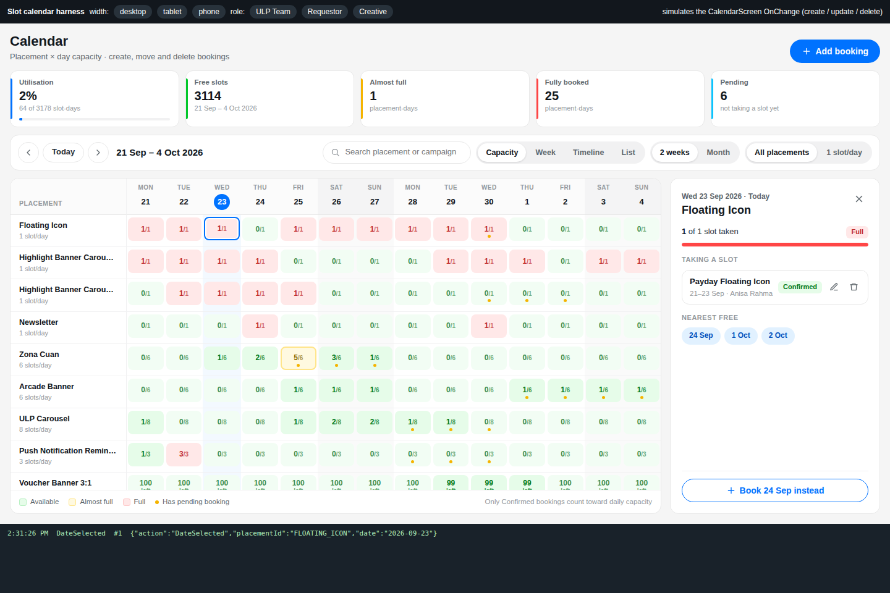
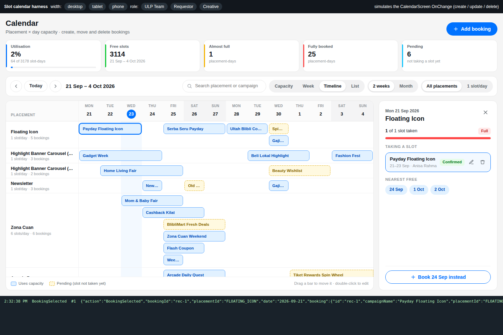
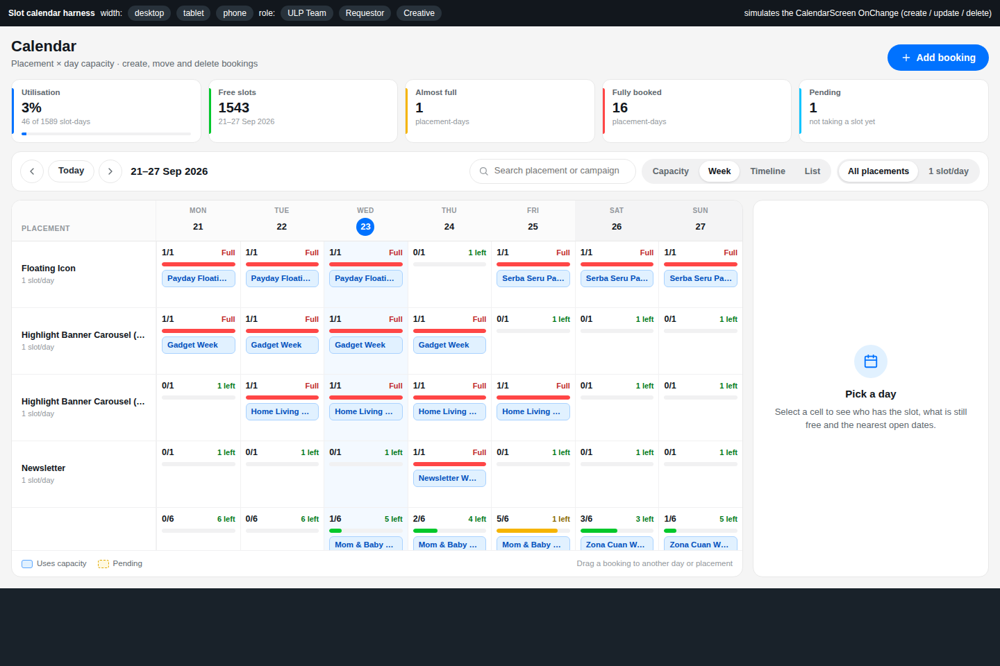
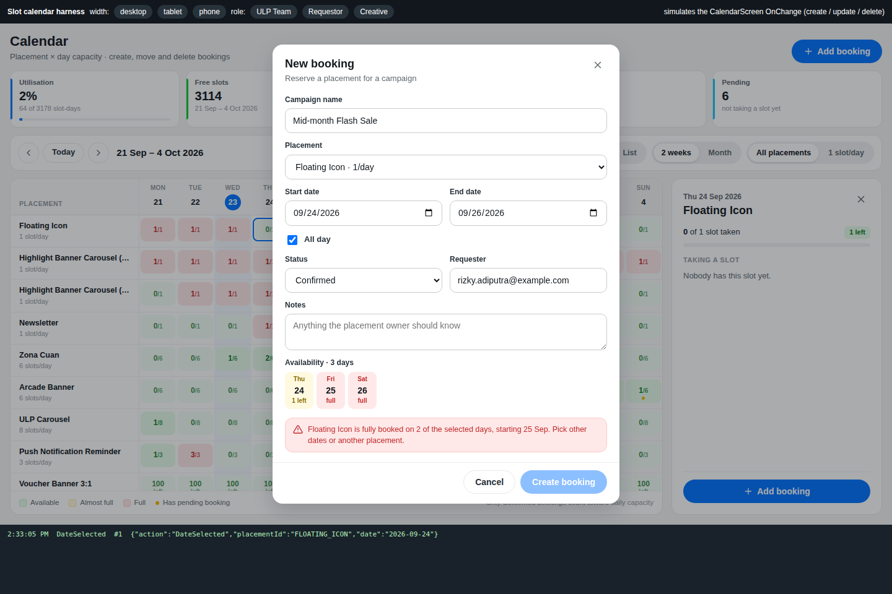
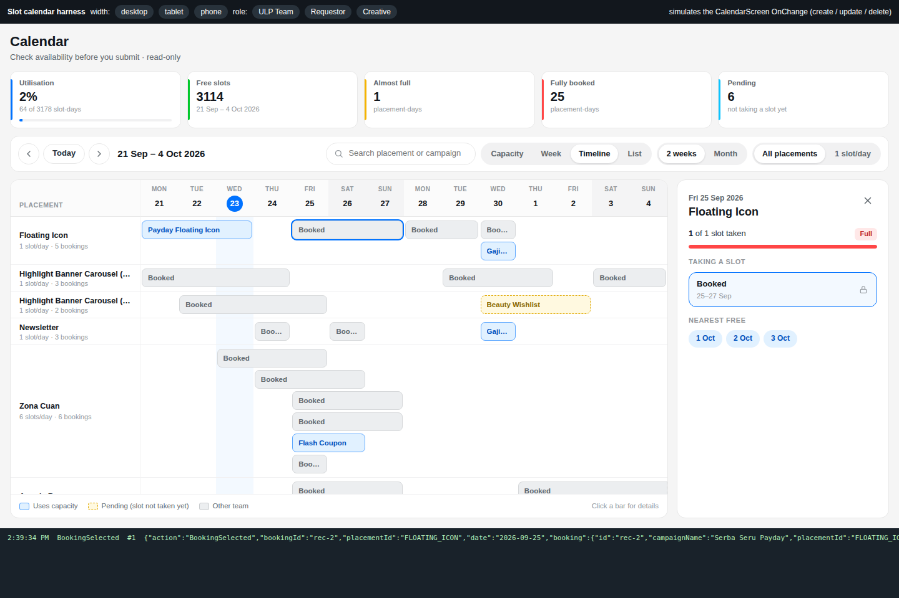
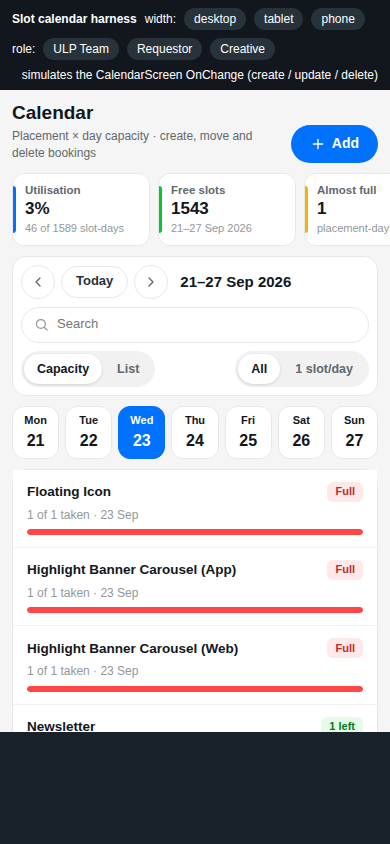

# MarketingSlotCalendar — PCF control v2

Source for the `DK.Components.MarketingSlotCalendar` code component (solution
`MarketingSlotCalendarSolution`, previously 1.1.0) used on **CalendarScreen**, **CalendarScreenUser** and
**CalendarCreative** in ULP Hub. v2 redraws it in the Blibli (Blu Basic) look of the ULP Hub dashboard
mockups: a placement × day capacity matrix, a day-detail panel, a bookings timeline and a phone agenda.

**The contract is unchanged.** Same namespace, constructor, datasets and property-sets, input properties,
and outputs (`LastAction`, `LastActionPayload`, `SelectedBookingId`, `SelectedPlacementId`,
`SelectedDate`, `EventCount`) with the same payload shape. The existing `OnChange` keeps working. v2 adds
three optional properties.



## What changed

| Area | 1.1 | 2.0 |
|---|---|---|
| Capacity (`DefaultView = Month`) | month matrix | 2-week or whole-month matrix; cells show *used / capacity* and are coloured Available / Almost full / Full. A dot marks pending bookings. Sticky placement column and day header. Today is highlighted and scrolled into view. Arrow keys move between cells |
| Day detail | drawer | side panel on wide screens, bottom sheet on tablet and phone. Shows the usage bar, *Taking a slot* and *Pending* lists (edit / delete per booking), the next three free days as chips, and *Add booking*, or *Book <nearest free> instead* when the day is full |
| Week | scheduler | 7-day board: every cell shows used / capacity, a meter and the booking chips. Chips drag to another day or placement, and `+` adds a booking |
| Timeline | bars | one lane per overlap. Bars that use capacity are blue, pending ones dashed yellow, other teams' grey. Drag a bar to move it (the drop target turns green or red from a live capacity check). Double-click to edit |
| List | table | sortable table (campaign, placement, dates, status, requester) with edit / delete; cards on small widths |
| Booking form | dialog | availability strip for every chosen day, blocking message when a day is full, *All day* toggle, status list built from the data |
| Header | title + KPI cards | title, *Add booking*, KPI strip (utilisation, free slots, almost full, fully booked, pending) for the visible range, search, view / period / *1 slot/day* switches |
| Phone | — | day strip + one card per placement with a usage bar. The whole control scrolls |

| Timeline | Week | Booking dialog | Requestor (masked) | Phone |
|---|---|---|---|---|
|  |  |  |  |  |

## Outputs (unchanged)

`LastAction` is one of `DateSelected`, `BookingSelected`, `BookingCreated`, `BookingUpdated` (edit or
drag) or `BookingDeleted`. `EventCount` goes up on every action. `LastActionPayload` looks like this:

```json
{"action":"BookingUpdated","bookingId":"rec-1","placementId":"FLOATING_ICON","date":"2026-10-01",
 "booking":{"id":"rec-1","campaignName":"Payday Floating Icon","placementId":"FLOATING_ICON","startDate":"2026-10-01","endDate":"2026-10-03","startTime":"00:00","endTime":"23:59","requester":"…","status":"Confirmed","notes":"-"},
 "previous":{"…":"the booking before the change"}}
```

New bookings carry a `new-<yyyy-mm-dd>-<random>` id, as in 1.1. Delete now asks for confirmation first.

## New optional properties

| Property | Default | Purpose |
|---|---|---|
| `CapacityStatuses` | *(blank)* | statuses that take a slot, e.g. `Confirmed`. Other bookings still show, marked as pending, but leave the day free. Blank = every booking except Cancelled / Rejected (1.1 counted Rejected too) |
| `CurrentUserEmail` | *(blank)* | usually `User().Email`; used by `MaskOtherBookings` |
| `MaskOtherBookings` | `false` | when on, bookings of other requesters show as **Booked**, with campaign, requester, notes and status hidden. They cannot be edited, moved or deleted. Meant for CalendarScreenUser |

Recommended settings:

- **ULP Team:** `CapacityStatuses = "Confirmed"`.
- **Requestor:** `CapacityStatuses = "Confirmed"`, `CurrentUserEmail = User().Email`,
  `MaskOtherBookings = true`, and `AllowCreate`, `AllowEdit`, `AllowDelete`, `AllowDragDrop` all set to false.

## Data

The precedence is the same as 1.1:

- **`DataMode = Auto`** reads the datasets first, then `PlacementsJson` / `BookingsJson`, then built-in
  sample data. The sample is flagged with a *Sample data* badge.
- **Column matching:** the bound property-set column wins. Otherwise the first column whose name looks
  right is used (for example `Title` → name, `StartDate`, `BookingStatus`).
- **Placement code (new):** if the Placements dataset has a `PlacementId` column (as
  `[ULP] Placement Calendar` does), that code becomes the placement id. Bookings are then matched on the
  code the `[ULP] Booking Calendar` rows store. Bookings that point at the record id still match.
- **`IncludeStatuses`:** hides bookings, and hidden bookings use no capacity, as in 1.1.
- **`ErrorMessage`:** replaces the calendar with an error state. Bad JSON shows as a banner.

## Build, test, package

```bash
npm run build
node harness/serve.js     # http://localhost:8181/harness/calendar.html
npm run package -- --base path/to/MarketingSlotCalendarSolution_managed.zip --version 2.0.0.0
```

The harness binds mock datasets with the SharePoint column names and property-set aliases. It also
simulates the CalendarScreen `OnChange`: create, update and delete rewrite the list and push it back.

Query flags:

- `?role=requestor` (masked, read-only) and `?role=creative`
- `?cap=` (blank capacity rule)
- `?view=Timeline`
- `?mode=Mock`
- `?loading=1`
- `?error=…`
- `?kpi=Comfortable`
